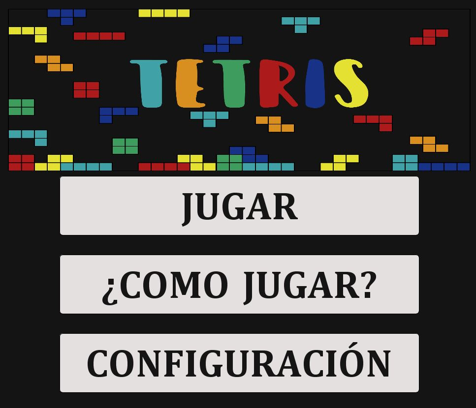
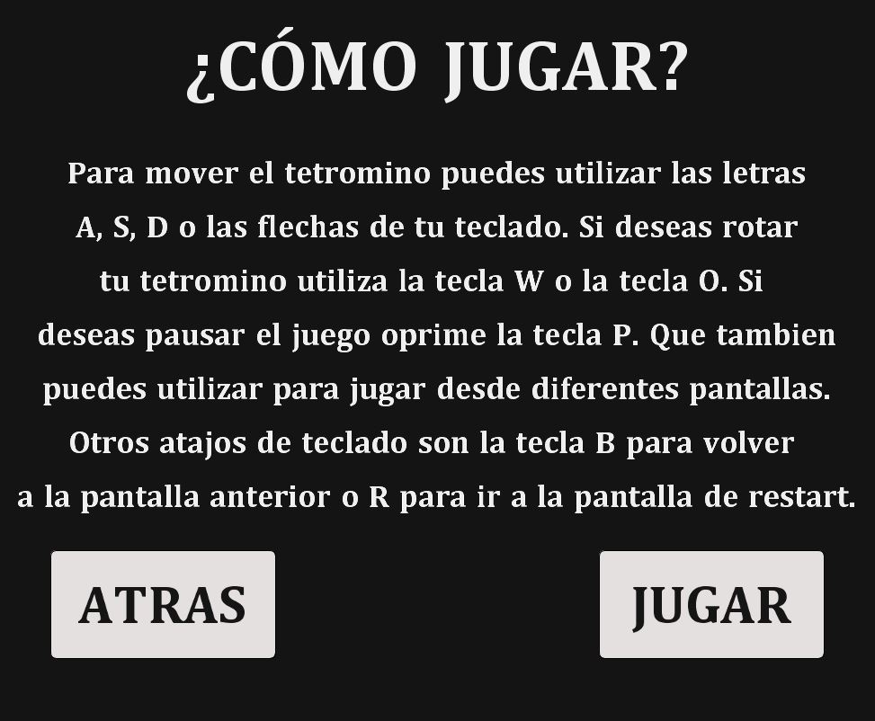
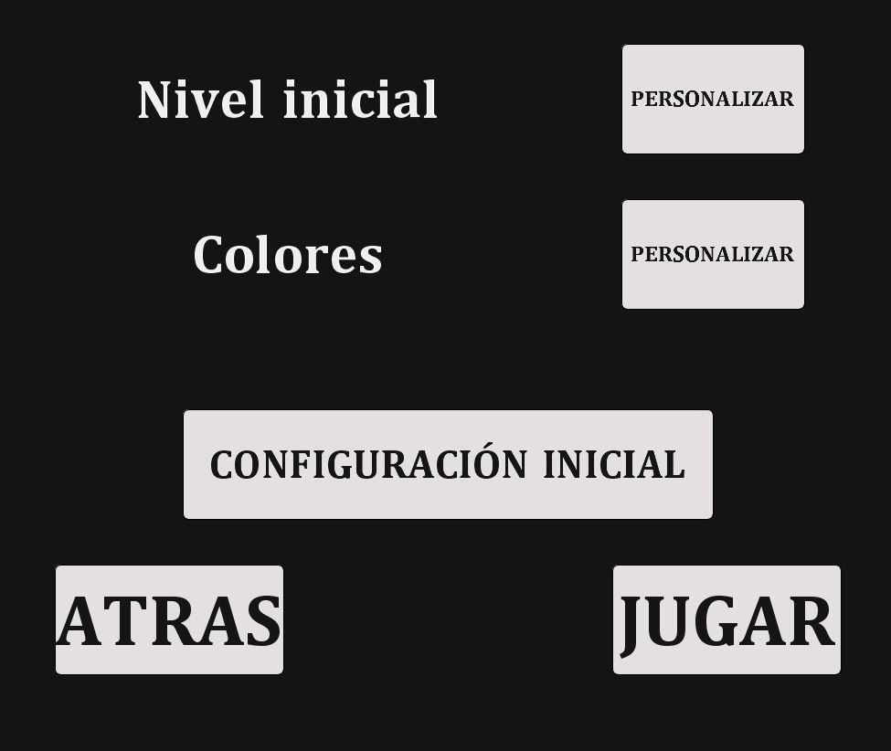
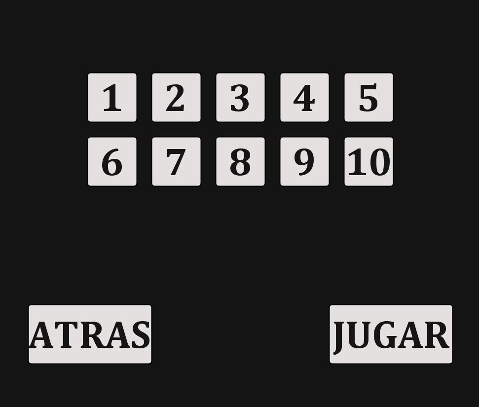
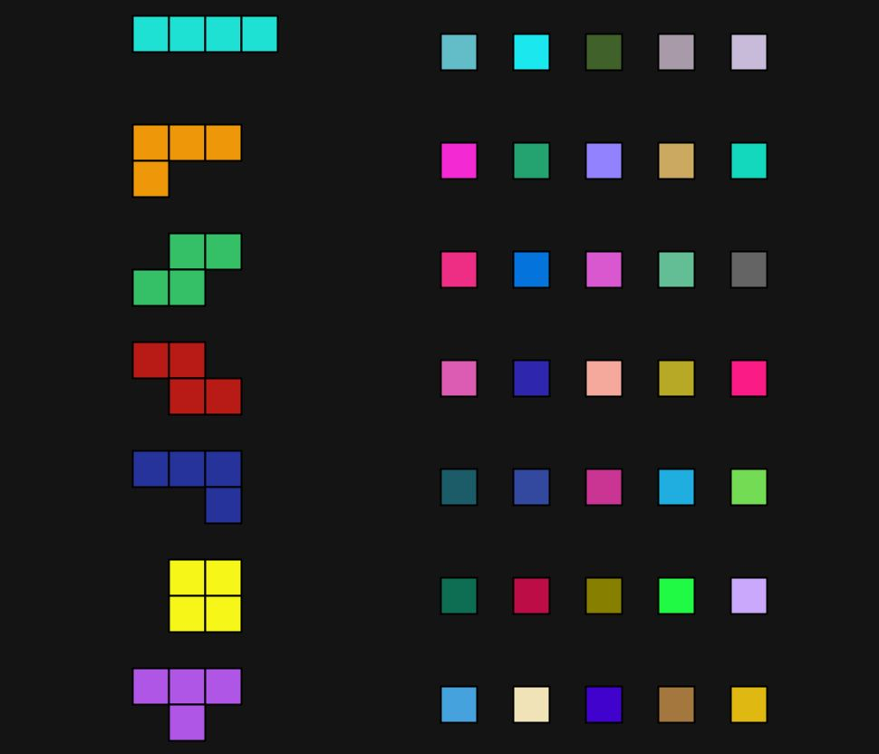
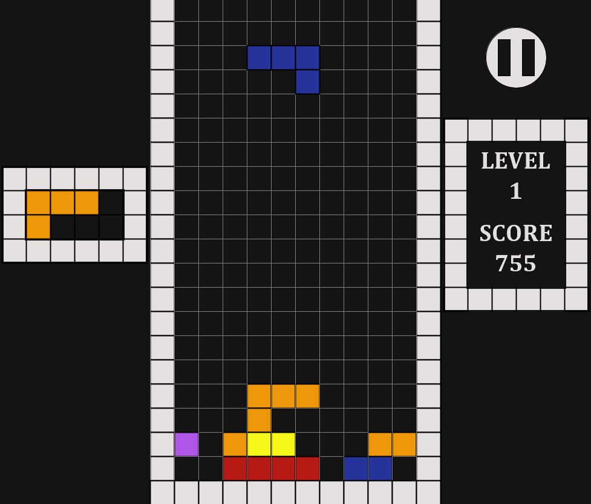
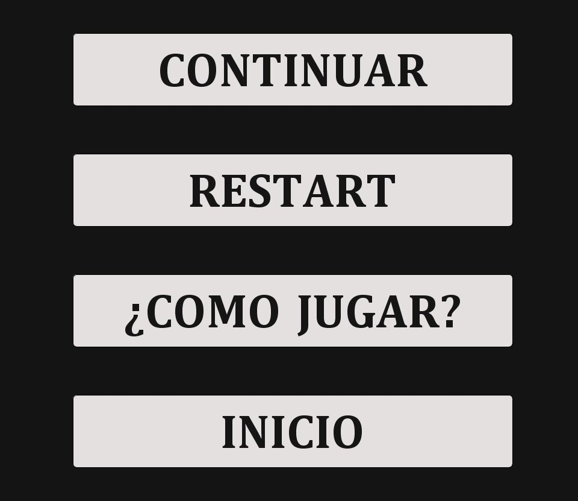
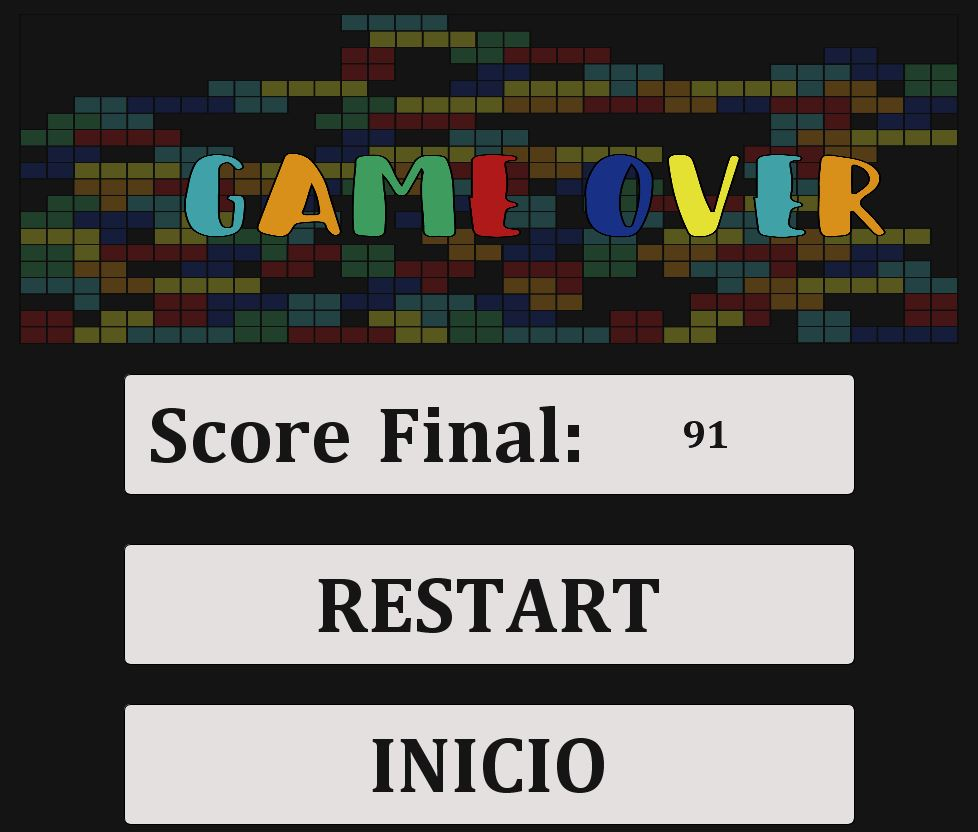
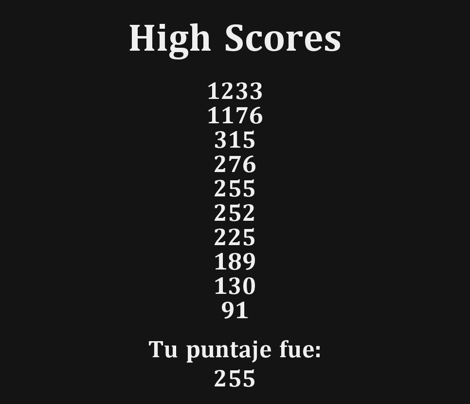
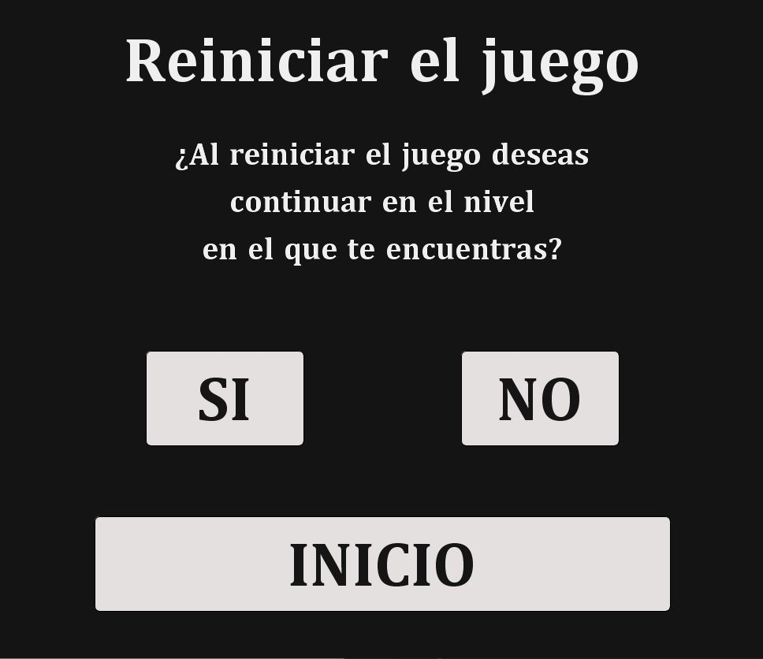

# :large_orange_diamond: Juego de Tetris :large_orange_diamond:
Autor: Andrés Felipe Forero Salas 

GitHub nickname: [fore1806](https://github.com/fore1806) 

Programación Orientada a Objetos

Universidad Nacional de Colombia Sede Bogotá

En el presente proyecto se pretende realizar un repaso de programación estructurada para la materia de Programación Orientada a Objetos, mediante el desarrollo de un juego de tetris en processing.

## Objetivo:

Repasar los conceptos básicos de la programación estructurada al implementar el juego del tetris.

## Implementación:

Para el desarrollo de este juego de tetris, se utilizaron los conceptos de la programación estructurada, teniendo vital importancia el uso de operaciones de bitwise para la diagramación de los tetrominos y la evaluación de las colisiones de los mismos. Para la representación del tablero se utilizó un arreglo dinámico que permitiera realizar de manera facil el almacenamiento de los tetrominos que ya han caido, así como la evaluación y eliminación de filas que se encuentren completas. En el desarrollo de la interfaz gráfica, fue indispensable el uso de variables de tipo booleanas y el desarrollo de diversos métodos que incluyen el uso de condicionales, ciclos y las funciones predeterminadas de la API de Processing.

## Conclusiones:

- Mediante el desarrollo de este proyecto se evidenció la importancia y utilidad de trabajar con las operaciones bitwise, como una representación de diferentes elementos en el desarrollo de un proyecto en programación estructurada.

- Se evidenció que la programación estructurada es un buen paradigma a la hora de desarrollar diversos proyectos, sin embargo, el conocer diversos paradigmas de programación nos permite como programadores evaluar, cual nos ayuda a resolver de mejor manera un problema. Por lo que es el momento de comenzar a aprender el paradigma de Programación Orientada a Objetos (POO) y así como programadores tener más opciones a la hora de desarrollar un proyecto.

## Instrucciones de Juego:

A continuación se presenta una pequeña guía de como jugar este Tetris, con la lectura de estas instrucciones conocerás los principales comandos de teclado que serán útiles a la hora de jugar. 

### Pantalla de Inicio:

Esta es la pantalla inicial del juego, aquí puedes utilizar tu mouse para navegar entre las diferentes funcionalidades del proyecto, además puedes utilizar tu teclado para acceder a diferentes pantallas.

|Tecla|                               Atajo                            |
|-----|----------------------------------------------------------------|
|  P  |Te lleva directamente al juego con las configuraciones iniciales|
|  H  |Te lleva a la pantalla de como jugar                            |
|  C  |Te lleva a la pantalla de Configuración                         |

### Pantalla de Como Jugar:

En esta pantalla se encuentran unas instrucciones básicas para poder jugar Tetris. Para navegar entre pantallas se puede utilizar el mouse o los siguientes atajos de teclado.

|Tecla|                               Atajo                            |
|-----|----------------------------------------------------------------|
|  P  |Te lleva directamente al juego con las configuraciones iniciales|
|  B  |Te lleva a la pantalla de inicio                                |

### Pantalla de Configuración:

En esta pantalla puedes modificar la configuración inicial del juego, es decir, los colores de los tetrominos, y el nivel inicial del Tetris. Estas tareas se pueden realizar con el mouse o con las teclas, mencionadas a continuación.

|Tecla|                               Atajo                            |
|-----|----------------------------------------------------------------|
|  N  |Te lleva a la pantalla de selección de Niveles                  |
|  C  |Te lleva a la pantalla de selección de Colores                  |
|  I  |Reestablece las configuraciones iniciales de colores y nivel    |
|  P  |Te lleva directamente al juego con la configuración determinada |
|  B  |Te lleva a la pantalla de inicio                                |

#### Pantalla de Selección de Nivel

En esta pantalla seleccionas el nivel en el que comienza el juego, que definirá la velocidad con la que bajan los tetrominos, y la ponderación que tendra el eliminar las filas que se encuentran completamente llenas. Para seleccionar el nivel debes utilizar el mouse.

#### Pantalla de Selección de Colores

En esta pantalla seleccionas el color de cada uno de los tetrominos. Para elegir los colores debes utilizar el mouse.

Los atajos de teclado para ambas pantallas (Selección de Niveles y Colores) se relacionan a continuación

|Tecla|                               Atajo                            |
|-----|----------------------------------------------------------------|
|  P  |Te lleva al juego con las configuraciones realizadas            |
|  B  |Te lleva a la pantalla de configuración                         |

### Pantalla de Juego:

En esta pantalla el juego tiene lugar, en ella se observan el puntaje, nivel y el siguiente tetromino de la partida actual. Para jugar se utilizan los siguientes comandos

| Tecla |                               Atajo                            |
|-----  |----------------------------------------------------------------|
| S-Down|Mueve el tetromino una posición hacia abajo                     |
| A-Left|Mueve el tetromino una posición a la izquierda                  |
|D-Right|Mueve el tetromino una posición a la derecha                    |
|  W-O  |Hace que el tetromino haga una rotación en sentido horario      |
|   P   |Te lleva al menú de Pausa                                       |

#### Menú de Pausa

En el menú de Pausa se pueden realizar diferentes tareas, desde seguir jugando, pasando por recomenzar el juego y hasata ir a la pantalla de inicio. Para estas funcionalidades contamos con diferentes atajos de teclado.

|Tecla|                               Atajo                            |
|-----|----------------------------------------------------------------|
|  P  |Te permite continuar con la partida actual                      |
|  R  |Te lleva a la pantalla de una nueva partida                     |
|  H  |Te lleva a la pantalla de Como Jugar                            |
|  I  |Te lleva a la pantalla de Inicio                                |

### Pantalla de Game Over

Esta pantalla solo se muestra una vez has perdido, en ella se observa tu puntaje y otras opciones a las que se puede acceder con el mouse o con tu teclado de la siguiente forma

|Tecla|                               Atajo                            |
|-----|----------------------------------------------------------------|
|  S  |Puedes consultar los puntajes más altos del juego               |
|  R  |Te lleva a la pantalla de volver a jugar                        |
|  I  |Te lleva a la pantalla de Inicio                                |

#### Pantalla de Mejores Puntajes

A esta pantalla se puede acceder haciendo click sobre el puntaje obtenido una vez has perdido el juego, o utilizando la tecla S como se mencionó anteriormente. En esta pantalla se presentan los mejores puntajes obtenidos en el juego durante una sesión. Para seguir jugando o hacer uso de otras funcionalidades se deben utilizar los siguientes atajos de teclado.

|Tecla|                               Atajo                            |
|-----|----------------------------------------------------------------|
|  B  |Te permite volver a la pantalla anterior (pantalla de Game Over)|
|  R  |Te lleva a la pantalla de volver a jugar                        |
|  I  |Te lleva a la pantalla de Inicio                                |

#### Pantalla de Volver a Jugar

Esta pantalla te da la opción de volver a jugar en el nivel en el que perdiste durante la partida inmediatamente anterior, o volver a comenzar desde el nivel 1. Para acceder a estas opciones debes utilizar el mouse de tu computador.

Diviertete al máximo con mi juego :smiley: :v: :sunglasses:
